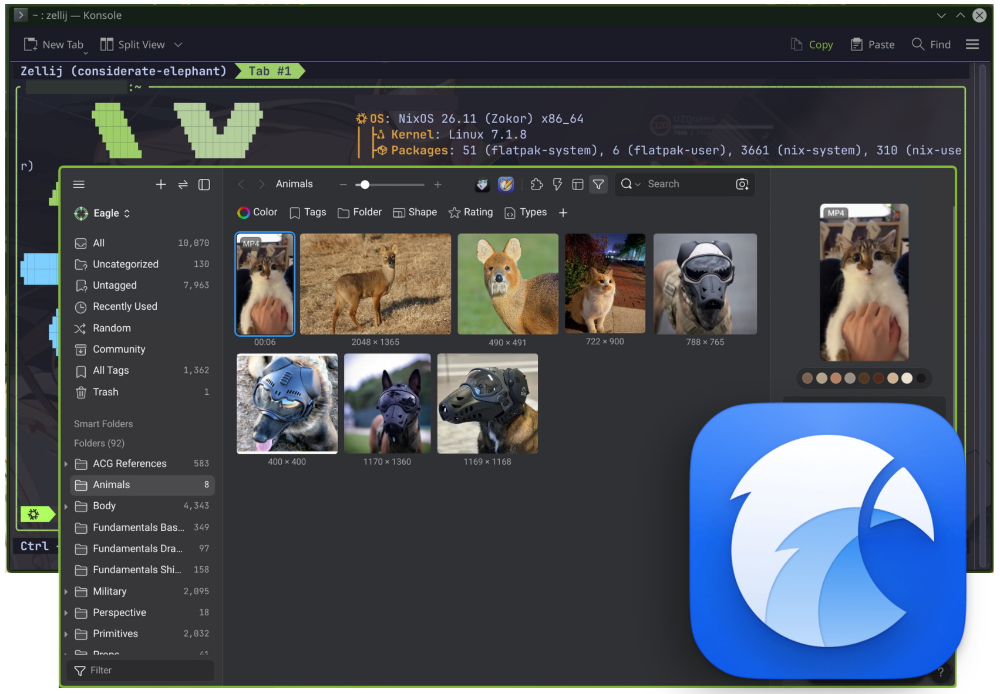

<p align="center">
  
</p>

<h1 align="center">Eagle for Linux (Unofficial)</h1>
<h6 align="center">(Although this let's you install a macOS package too 😉)</h6>

<p align="center">
  <a href="https://github.com/Naitrate/Eagle-Linux/actions/workflows/packages.yml"></a>
  <a href="https://github.com/Naitrate/Eagle-Linux/actions/workflows/nix.yml"></a>
  <a href="https://eagle-nix.cachix.org"></a>
  <a href="https://github.com/Naitrate/Eagle-Linux/releases"></a>
</p>

<p align="center">
  <b>Unofficial native Linux port for the <a href="https://eagle.cool">Eagle</a> digital asset manager.</b>
</p>

<p align="center">
  <a href="#-quick-start--installation">Install</a> ·
  <a href="#-nixos-declarative-installation--udev-rules">NixOS</a> ·
  <a href="#-flatpak-repository-setup">Flatpak Repo</a> ·
  <a href="#-feature-matrix">Features</a> ·
  <a href="#-cachix-binary-cache-setup">Cachix</a> ·
  <a href="BUILDING.md">Build Instructions</a> ·
  <a href="DEVELOPING.md">Maintainer Docs</a>
</p>

<p align="center">
  
</p>

---

`Eagle for Linux` bridges official [Eagle.cool](https://eagle.cool) releases to the Linux desktop. It extracts signed upstream payloads, patches native Electron bindings, implements hardware DMI machine-ID verification rules, registers native D-Bus KDE Plasma global shortcuts, and packages production-ready AppImage, RPM, Arch Linux, Flatpak, and Nix Flake outputs.

---

## 🚀 Quick Start & Installation

| Platform / Format   | Recommended Command / Action                                                                             | Result                         |
| ------------------- | -------------------------------------------------------------------------------------------------------- | ------------------------------ |
| **Flatpak Repo**    | `flatpak remote-add --user --if-not-exists eagle-repo https://naitrate.github.io/Eagle-Linux/eagle.flatpakrepo` | Auto-updating Flatpak repo     |
| **NixOS (Flakes)**  | `nix run github:Naitrate/Eagle-Linux --impure`                                                           | Run instantly via Nix Flake    |
| **NixOS (Classic)** | `environment.systemPackages = [ (pkgs.callPackage ./default.nix {}) ];`                                  | System package with udev rules |
| **AppImage**        | Download `Eagle-4.0.3-x86_64.AppImage` from [Releases](https://github.com/Naitrate/Eagle-Linux/releases) | Universal portable binary      |
| **Fedora / RHEL (COPR)** | `sudo dnf copr enable naitrate/eagle && sudo dnf install eagle` — [needs RPM Fusion](#-fedora--rhel-copr-repository-setup) | Auto-updating Fedora COPR repo |
| **Fedora / RHEL (RPM)**  | `sudo dnf install ./build/eagle-4.0.3-1.x86_64.rpm` — [needs RPM Fusion](#-fedora--rhel-copr-repository-setup) | Standalone RPM package         |
| **Arch / Manjaro**  | `sudo pacman -U ./build/eagle-bin-4.0.3-1-x86_64.pkg.tar.zst`                                            | Native Pacman package          |
| **Flatpak Bundle**  | `flatpak install build/cool.eagle.Eagle.flatpak`                                                         | Sandboxed Flatpak bundle       |

---

## 🎩 Fedora / RHEL COPR Repository Setup

Add the official Eagle COPR repository for automatic updates on Fedora, RHEL, AlmaLinux, and Rocky Linux:

```bash
# 1. Enable RPM Fusion (required - see note below)
sudo dnf install \
  https://mirrors.rpmfusion.org/free/fedora/rpmfusion-free-release-$(rpm -E %fedora).noarch.rpm

# 2. Enable the Eagle COPR repository
sudo dnf copr enable naitrate/eagle

# 3. Install Eagle
sudo dnf install eagle
```

> [!IMPORTANT]
> **RPM Fusion is required on Fedora and RHEL.** Eagle depends on `ffmpeg`
> for video and audio previews, and Fedora ships only `ffmpeg-free` in its
> official repositories, which omits the patent-encumbered codecs Eagle
> needs. Without RPM Fusion enabled, `dnf` cannot satisfy the `ffmpeg`
> dependency and the install fails. On RHEL, AlmaLinux and Rocky you also
> need EPEL.

> [!NOTE]
> For package maintainer documentation on COPR repository setup using `make srpm`, see [`packaging/fedora/COPR.md`](packaging/fedora/COPR.md).

---

## 📦 Flatpak Repository Setup

Add the official Eagle Flatpak repository for automatic updates:

```bash
# 1. Add the Eagle Flatpak repository
flatpak remote-add --user --if-not-exists eagle-repo https://naitrate.github.io/Eagle-Linux/eagle.flatpakrepo

# 2. Install Eagle
flatpak install --user eagle-repo cool.eagle.Eagle
```

---

## ❄️ NixOS Declarative Installation & udev Rules

On NixOS, add the package and required `udev` rule (which grants read access to `/sys/class/dmi/id/product_uuid` for Machine ID licensing) to your `configuration.nix`:

### Option A: Using Flakes (`flake.nix`)

Add Eagle as an input to your system `flake.nix`:

```nix
inputs.eagle.url = "github:Naitrate/Eagle-Linux";
```

Then in your NixOS configuration module (`configuration.nix`):

```nix
environment.systemPackages = [
  inputs.eagle.packages.${pkgs.system}.default
];

# Required for Machine ID hardware licensing verification
services.udev.packages = [
  inputs.eagle.packages.${pkgs.system}.default
];
```

### Option B: Classic Nix (`configuration.nix`)

```nix
let
  eagle = pkgs.callPackage (fetchTarball "https://github.com/Naitrate/Eagle-Linux/archive/master.tar.gz") { };
in
{
  environment.systemPackages = [ eagle ];

  # Required for Machine ID hardware licensing verification
  services.udev.packages = [ eagle ];
}
```

---

## ⚡ Cachix Binary Cache Setup

Avoid compiling or extracting locally by enabling pre-built binaries from [Cachix](https://cachix.org).

### Quick Setup (Cachix CLI)

```bash
cachix use eagle-nix
```

### Declarative NixOS Configuration (`configuration.nix` / Flake)

```nix
nix.settings = {
  substituters = [
    "https://eagle-nix.cachix.org"
  ];
  trusted-public-keys = [
    "eagle-nix.cachix.org-1:DEOBgPrQjX+7Z0IwUtGLWULt1HbK4lkUXypY07dKdSQ="
  ];
};
```

---

## 🧠 Enabling GPU-Accelerated AI Search (Optional)

Configure GPU hardware acceleration for Eagle's AI Search functionality (`"cuda"`, `"rocm"`, or `"cpu"`):

**Nix Flakes (`flake.nix`):**

```nix
environment.systemPackages = [
  (inputs.eagle.packages.${pkgs.system}.default.override {
    enableAiSearch = true;
    gpuBackend = "cuda"; # Options: "cuda", "rocm", "cpu"
  })
];
```

**Classic Nix (`default.nix`):**

```nix
environment.systemPackages = [
  ((pkgs.callPackage ./default.nix { }).override {
    enableAiSearch = true;
    gpuBackend = "cuda";
  })
];
```

> **Hardware Licensing Note**: Eagle relies on the system DMI product UUID for Machine ID licensing verification on Linux. The included `udev` rule (`99-eagle-dmi.rules`) grants unprivileged read access to `/sys/class/dmi/id/product_uuid`.

---

## ✨ Feature Matrix

| Feature                         | Support    | Implementation Details                                                     |
| ------------------------------- | ---------- | -------------------------------------------------------------------------- |
| **Native DMI Licensing**        | ✅ Included | Read access to `/sys/class/dmi/id/product_uuid` via udev / host filesystem |
| **KDE Plasma Global Shortcuts** | ✅ Included | D-Bus integration via `org.kde.kglobalaccel` for all 150 shortcut actions  |
| **Multi-Distro Packaging**      | ✅ Included | AppImage, RPM, Arch Linux PKGBUILD, Flatpak, and Nix Flakes                |
| **GPU AI Search**               | ✅ Included | PyTorch & FAISS bindings with CUDA / ROCm / CPU backend support            |
| **macOS (Darwin) Support**      | ✅ Included | Unified Nix derivation supporting `aarch64-darwin` and `x86_64-darwin`     |

---

## 📚 Project Documentation

* **[BUILDING.md](BUILDING.md)** — Detailed multi-distro build commands, Docker container steps, and Flatpak instructions.
* **[DEVELOPING.md](DEVELOPING.md)** — Maintainer reference for GitHub Releases, pushing builds to Cachix, updating Flake locks, and layout extraction.

---

## 📜 Licensing & Disclaimer

- **Eagle Application**: [Eagle](https://eagle.cool) digital asset manager, upstream application code, binaries, logos, and trademarks are proprietary software and remain the exclusive property of **OGDesign / Eagle.cool**.
- **Linux Port & Packaging Scripts**: The Linux integration scripts, packaging definitions (AppImage, RPM, Arch, Flatpak, Nix Flakes), documentation, and custom patches in this repository are licensed under the MIT License:

**Eagle App for Linux Repository (c) 2026 Bryce Q. (Naitrate)**

**Permission is hereby granted, free of charge, to any person obtaining a copy
of this software and associated documentation files (the "Software"), to deal
in the Software without restriction, including without limitation the rights
to use, copy, modify, merge, publish, distribute, sublicense, and/or sell
copies of the Software, and to permit persons to whom the Software is
furnished to do so, subject to the following conditions:**

**The above copyright notice and this permission notice shall be included in all
copies or substantial portions of the Software.**

**THE SOFTWARE IS PROVIDED "AS IS", WITHOUT WARRANTY OF ANY KIND, EXPRESS OR
IMPLIED, INCLUDING BUT NOT LIMITED TO THE WARRANTIES OF MERCHANTABILITY,
FITNESS FOR A PARTICULAR PURPOSE AND NONINFRINGEMENT. IN NO EVENT SHALL THE
AUTHORS OR COPYRIGHT HOLDERS BE LIABLE FOR ANY CLAIM, DAMAGES OR OTHER
LIABILITY, WHETHER IN AN ACTION OF CONTRACT, TORT OR OTHERWISE, ARISING FROM,
OUT OF OR IN CONNECTION WITH THE SOFTWARE OR THE USE OR OTHER DEALINGS IN THE
SOFTWARE.**

**[See the MIT License for more details.](LICENSE)**

_**DISCLAIMER: This project is an unofficial community port and is not affiliated with or endorsed by OGDesign / Eagle.cool. Licensed under the MIT license for repository files only, in case a certain entity wants to implement my changes officially (hit me up, and I'll sort something out 😉).**_